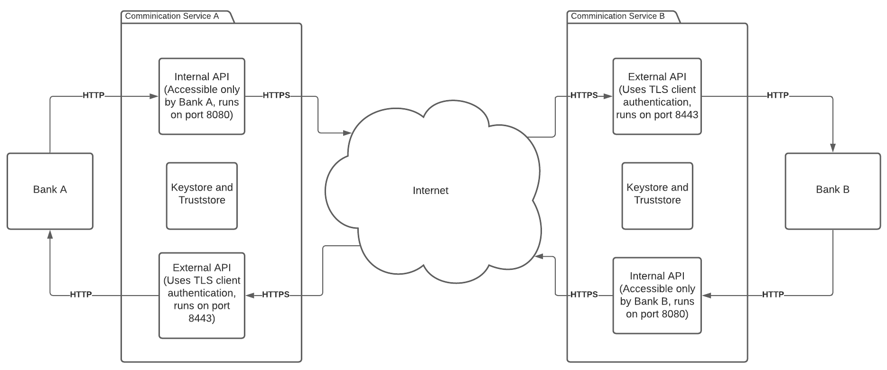
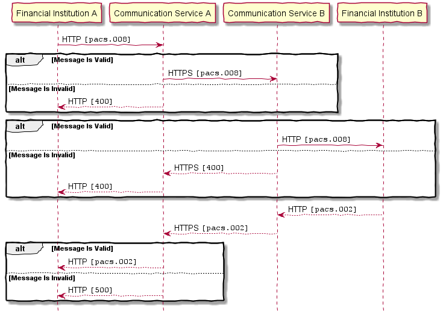
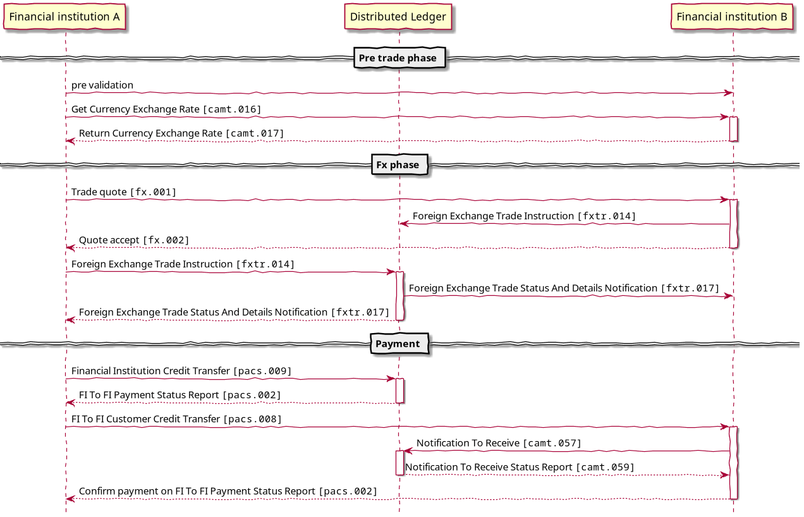

# Decentralized ISO20022
Financial Inclusion with decentralized ISO20022 as a microservice.

## Technologies
The technologies used in the project. 
- [Spring Boot](https://github.com/spring-projects/spring-boot) for the framework.
- [Prowide-ISO20022](https://github.com/prowide/prowide-iso20022) for parsing, creating and manipulating ISO20022 messages.

## System overview
An overview of the system.

## Sending and recieving a pacs.008 message
A sequence diagram for sending and recieving a pacs.008 message with the microservice. Communication service represents an instance of the microservice.

## Use in settlement and payments
An example use case of the microservice in payments with FX settlements on a distributed ledger, and the different ISO20022 messages that can be used for communication.

## Build Instructions
The following instructions describe how to set up the system.
  1. Run "start.cmd", one internal and one external service will start.
  2. Open Postman, or any other application that will simulate the bank system.
  3. In Postman, click "body" and select "raw".
  4. Copy the contents of `examples/messages/pacs00800109/example1WithHeader.xml`
     and paste it into the textbox in Postman.
  5. Select the "POST" method, enter the URL `localhost:8080/api/v1/pacs/` and
     click "Send".
  6. If successfull, you should see a message in the external service's command
     prompt window that shows the pacs.008 message that "was sent to the bank".