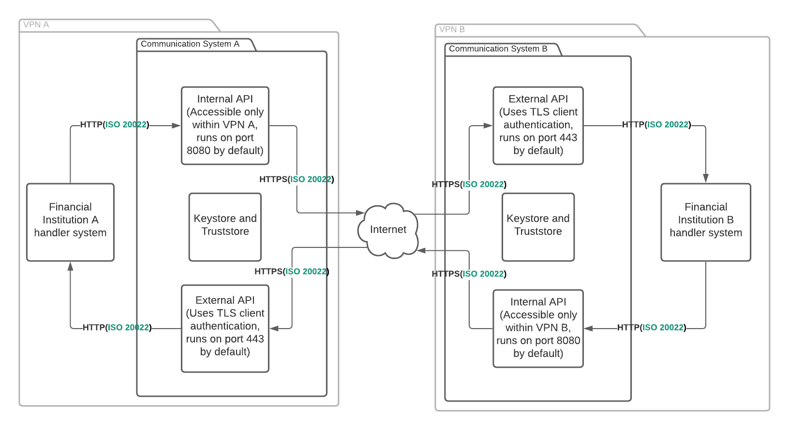

# Decentralized ISO20022
Financial Inclusion with decentralized ISO20022 as a microservice.

## Technologies
The technologies used in the project. 
- [Spring Boot](https://github.com/spring-projects/spring-boot) for the framework.
- [Prowide-ISO20022](https://github.com/prowide/prowide-iso20022) for parsing, creating and manipulating ISO20022 messages.

## System overview
An overview of the system.

## Sending and recieving a pacs.008 message
A sequence diagram for sending and recieving a pacs.008 message with the microservice. Communication service represents an instance of the microservice.

## Use in settlement and payments
An example use case of the microservice in payments with FX settlements on a distributed ledger, and the different ISO20022 messages that can be used for communication.

## Build Instructions
The following instructions describe how to set up the system.
   1. Navigate to `/decentralizediso20022`.
   3. The environment variables can be customized in the docker-compose files.
   4. Start docker containers. Start both docker containers the same time with `docker-compose -f docker-compose.external.yml -f docker-compose.internal.yml up --build`
   5. Or start the desired container with e.g. `docker-compose -f docker-compose.internal.yml up --build`
## Demo instructions
The following instructions describe how to demo the system.
   1. Navigate to `/decentralizediso20022`.
   3. The environment variables can be customized in the docker-compose files, but for demo purposes the default environment variables are enough.
   4. Start both docker containers at the same time with `docker-compose -f docker-compose.external.yml -f docker-compose.internal.yml up --build`.
   5. To make sure the microservices work as intenden you can send a post request to `internal`'s pacs endpoint. An example request payload can be found in `examples/demo/docker-demo.xml`. With the default environment variables the request should be sent to: `localhost:8080/api/v1/pacs`.
   6. If successfull the response should contain `The message was processed.`